# Ask Ivy

AI browser extension that takes real human inputs to personalize content, flag eligible benefits, fill out forms, and provide data-driven, actionable improvements for government websites.

## Features

- **Content Simplification** -- Rewrites web pages at a reading level you choose, adds plain-language tooltips for jargon, and adjusts font size, contrast, and motion (prototyped)
- **Benefits Discovery** -- Matches your profile against federal benefit programs using a deterministic rules engine, then ranks and explains results in plain language via AI (prototyped)
- **Highlight-to-Ask** -- Select any text on a page and ask Ivy to explain it (prototyped)
- **Form Guidance** -- Step-by-step explanations for government forms (planned)
- **Feedback Loop** -- Users provide natural language feedback on websites; aggregated insights can be supplied to site owners to improve accessibility (planned)

## Screenshots

### Onboarding

Ivy greets new users with a conversational setup flow, asking about reading comfort, jargon preferences, and visual needs.

<p align="center">
  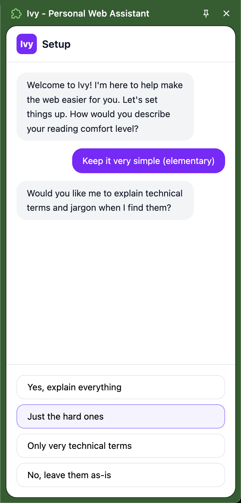
  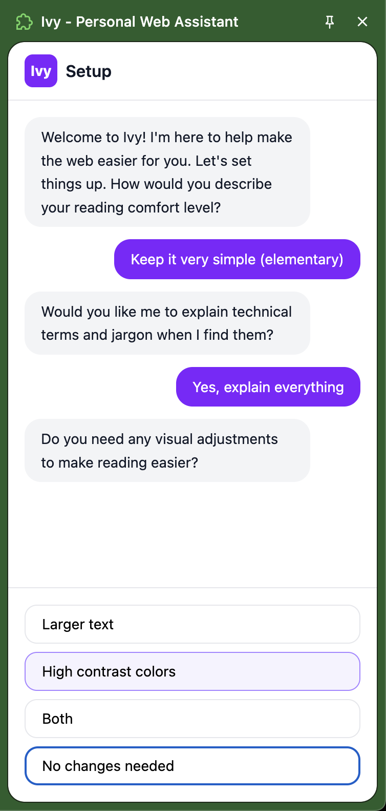
  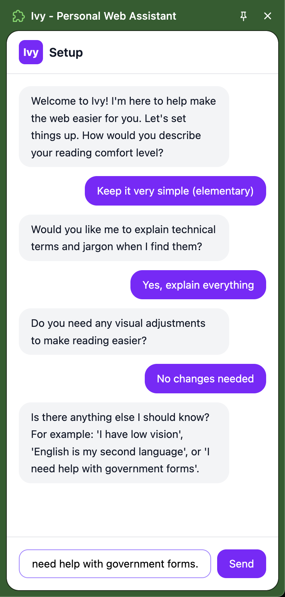
</p>

### Home & Settings

<p align="center">
  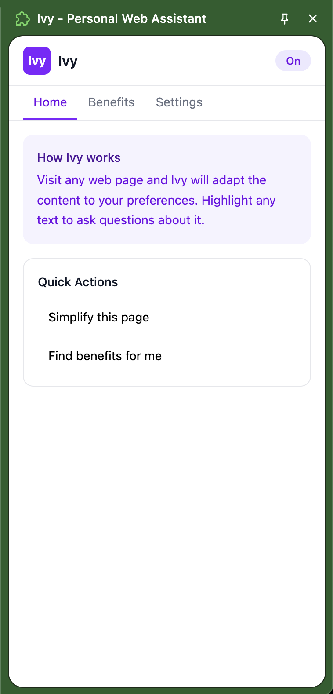
  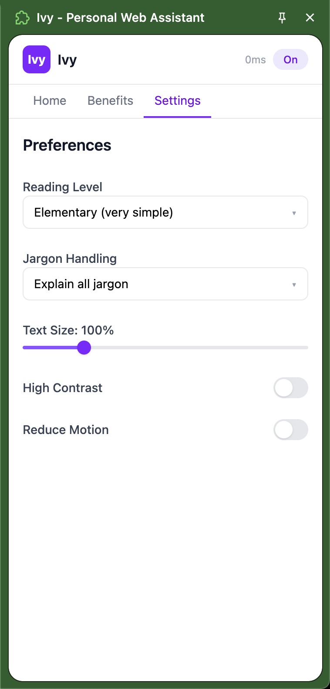
</p>

### Content Simplification

Click "Simplify this page" and Ivy rewrites complex text at your reading level, with jargon tooltips. Simplified sections are marked with a purple left border.

<p align="center">
  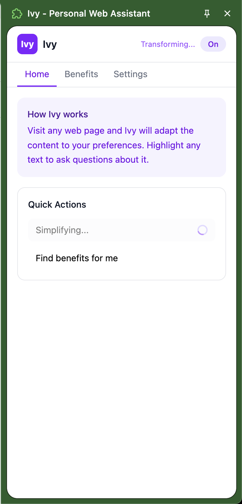
</p>

<p align="center">
  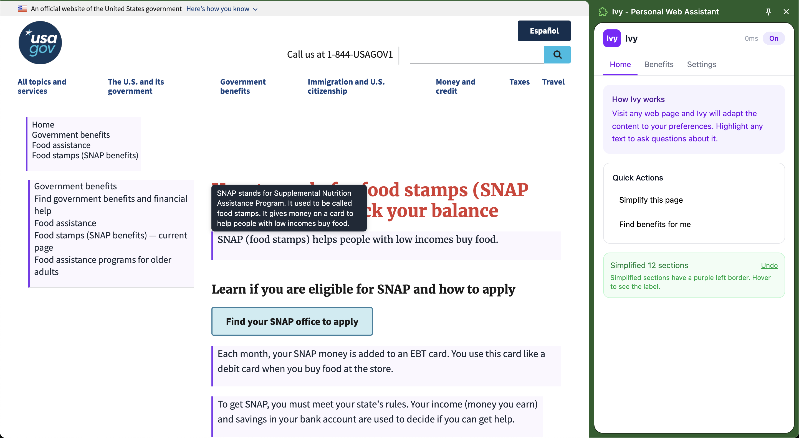
</p>

### Highlight-to-Ask

Select any text on a page and click "Ask Ivy" for a plain-language explanation.

<p align="center">
  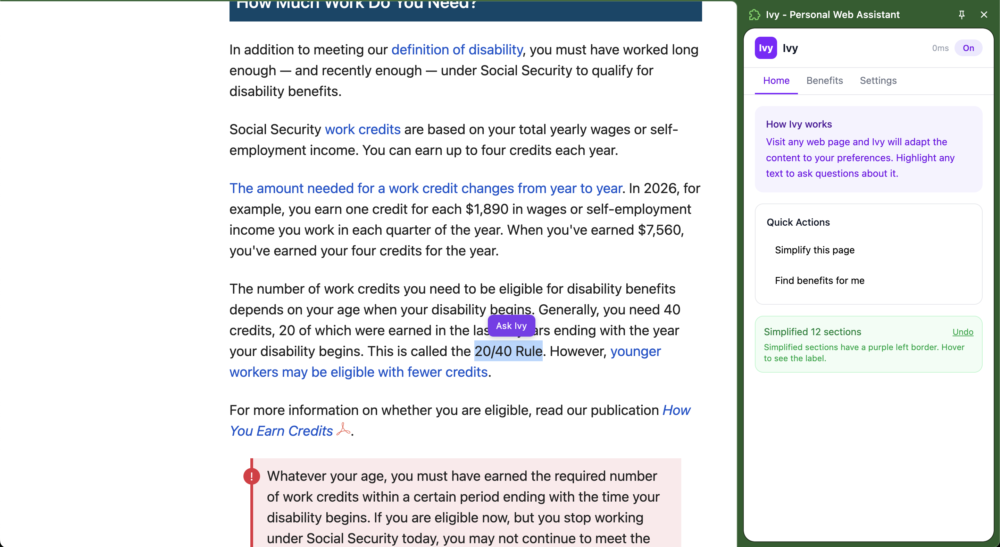
  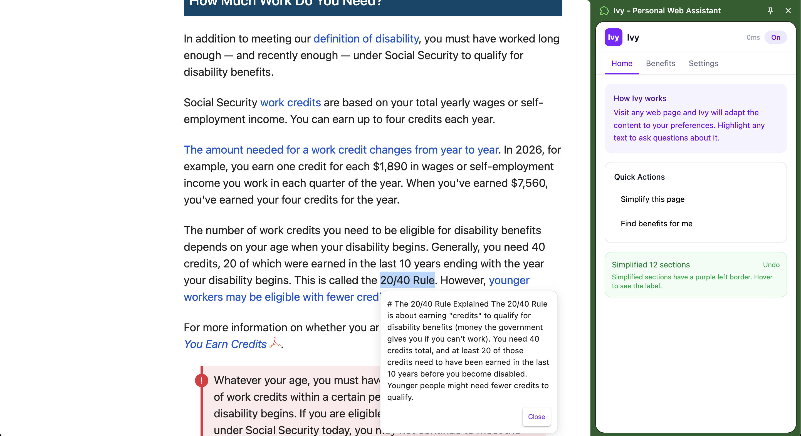
</p>

### Benefits Discovery

Fill out a short eligibility profile and Ivy matches you against federal benefit programs, ranked by likelihood with plain-language explanations.

<p align="center">
  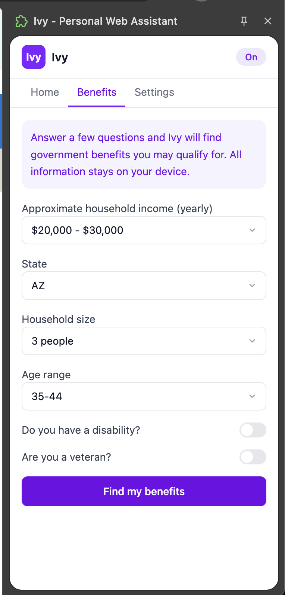
  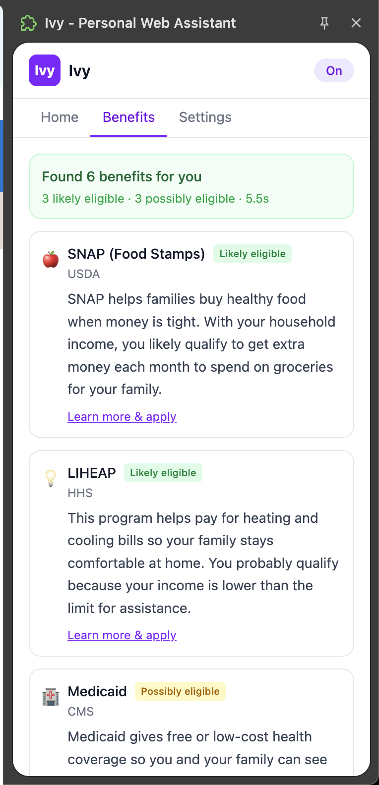
</p>

## Wireframes

Design wireframes for planned features, including the natural language setup flow, contextual text selection, and the government agency dashboard for aggregated user feedback and accessibility insights.

### Extension UI

<p align="center">
  
  
</p>

### Government Dashboard

A dashboard for government website owners showing accessibility scores, user behavior analytics, page-level insights, and commonly asked questions aggregated from Ivy users.

<p align="center">
  
  
  
</p>

## Architecture

```
Chrome Extension (WXT)
├── Sidebar UI (React + Radix UI + Tailwind)
├── Content Script (DOM transforms, highlight-to-ask)
└── Service Worker (orchestration, messaging)
        │
        ▼  HTTPS
Server (Node.js + Hono)
├── AI Transform Pipeline (Claude API)
├── Explain Endpoint
└── Benefits Evaluation
    ├── Deterministic Rules Engine (@ivy/benefits-engine)
    └── AI Ranking & Explanation (Claude Haiku)
```

## Monorepo Structure

```
ivy/
├── packages/
│   ├── shared/           # Types, message protocol, encryption utils, constants
│   ├── extension/        # WXT Chrome extension (MV3)
│   ├── server/           # Node.js API server (Hono)
│   └── benefits-engine/  # Deterministic eligibility rules
├── .github/workflows/    # CI (build, test, typecheck)
├── Dockerfile            # Multi-stage production build for server
├── turbo.json
└── pnpm-workspace.yaml
```

## Tech Stack

| Layer | Technology |
|-------|-----------|
| Extension framework | [WXT](https://wxt.dev) (MV3, cross-browser) |
| UI | React 19, Radix UI, Tailwind CSS 4 |
| State management | Zustand (persisted to chrome.storage) |
| Server | Node.js 22, Hono |
| AI | Claude API via `@anthropic-ai/sdk` |
| Monorepo | Turborepo, pnpm workspaces |
| Testing | Vitest |
| Client encryption | Web Crypto API (AES-256-GCM) |

## Getting Started

### Prerequisites

- Node.js 22+
- pnpm 9+ (enabled via corepack: `corepack enable`)
- An [Anthropic API key](https://console.anthropic.com/)

### Setup

```bash
# Install dependencies
pnpm install

# Configure environment
cp .env.example .env.local
# Edit .env.local and add your ANTHROPIC_API_KEY
```

### Development

Run the server and extension in separate terminals:

```bash
# Terminal 1: Start the API server (port 3001)
pnpm --filter @ivy/server dev

# Terminal 2: Start the extension dev server (opens Chrome with extension loaded)
pnpm --filter @ivy/extension dev
```

The extension dev server uses WXT's hot module replacement. The Chrome profile is stored in `packages/extension/.chrome-profile/` so your extension state persists across restarts.

### Build

```bash
# Build all packages
pnpm build

# Build just the extension (outputs to packages/extension/.output/chrome-mv3/)
pnpm --filter @ivy/extension build
```

### Test

```bash
# Run all tests
pnpm test

# Watch mode
pnpm test:watch
```

### Docker (server only)

```bash
docker build -t ivy-server .
docker run -p 3001:3001 -e ANTHROPIC_API_KEY=sk-ant-... ivy-server
```

## Environment Variables

| Variable | Required | Description |
|----------|----------|-------------|
| `ANTHROPIC_API_KEY` | Yes | Claude API key for AI features |
| `IVY_API_KEY` | No | Bearer token to protect API endpoints (skipped if unset) |
| `PORT` | No | Server port (default: 3001) |
| `DATABASE_URL` | No | Neon Postgres connection string (planned) |
| `UPSTASH_REDIS_REST_URL` | No | Redis URL for transform caching (planned) |
| `UPSTASH_REDIS_REST_TOKEN` | No | Redis auth token (planned) |

The extension reads `VITE_API_URL` (default: `http://localhost:3001`) and optionally `VITE_API_KEY` from its `.env.development` file.

## Security

- All AI prompts use XML tag isolation to prevent prompt injection
- Content script uses `DOMParser` and `textContent` instead of `innerHTML` to prevent XSS
- Client-side AES-256-GCM encryption for PII vault (Web Crypto API)
- API key authentication middleware on all `/api/*` endpoints
- CORS restricted to extension origins and explicit localhost ports
- Extension message listener validates `sender.id`
- Request validation with size limits on all endpoints

## License

Apache 2.0 -- see [LICENSE](LICENSE).
